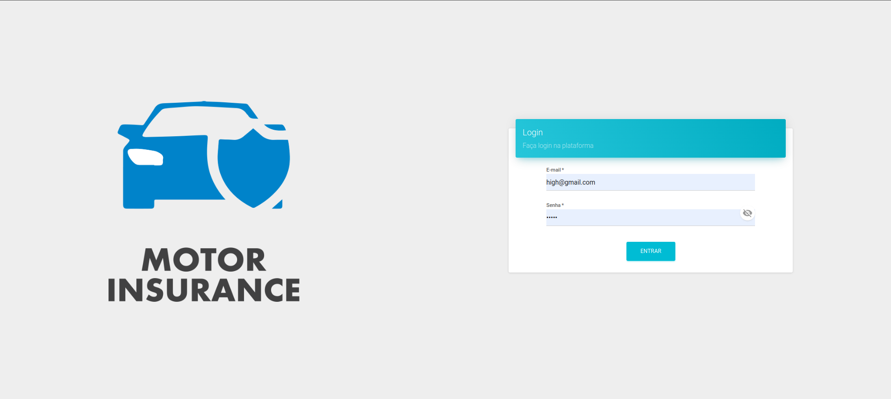
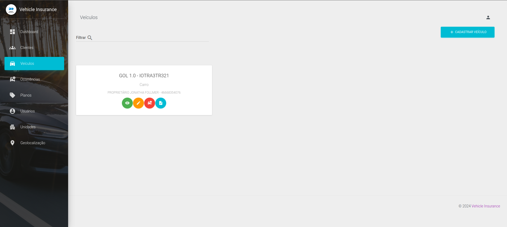

[![Contributors][contributors-shield]][contributors-url]
[![Forks][forks-shield]][forks-url]
[![Stargazers][stars-shield]][stars-url]

# Vehicle Protection Association

 
 

    Management system for Vehicle Protection Associations.
    The system offers a variety of features to make management easier, including:

<ul>
    <li>
        Member Registration: Ability to record detailed information about association members such as name, address, type of membership, and more.
    </li>
    <li>
        Vehicle management: Functionality to add, edit and delete information about associated vehicles, such as make, model, license plate, year of manufacture, etc.
    </li>
    <li>
        Membership Renewal: Automation of the membership renewal process, including automatic notifications about due dates and payment options.
    </li>
    <li>
        Access Control: Ability to restrict access to certain system resources based on defined permission levels.
    </li>
    <li>
        Event registration: Registration of important events related to members and vehicles, such as accidents, maintenance, traffic fines, among others.
    </li>
    <li>
        Reporting and analysis: Generation of detailed reports on various metrics, such as number of members, fleet composition, revenue and expenses, among others.
    </li>
</ul>

## Stacks

### Front-end

    Web app it was developed in Vue, Electron for desktop application, MaterialUI and SASS for styles and Axios to consume endpoints.

### Back-end

    The back-end was developed using Express and TypeScript, Prisma as an ORM linked to a MySQL connection.

    It is possible to run the application with Docker containers, so it is essential to have them installed.

## Architecture
... to do ...
## How to start application
... to do ...
##

<!-- MARKDOWN LINKS & IMAGES -->
<!-- https://www.markdownguide.org/basic-syntax/#reference-style-links -->
[contributors-shield]: https://img.shields.io/github/contributors/ElJohnnie/vehicle-insurance-system.svg?style=for-the-badge
[contributors-url]: https://github.com/ElJohnnie/vehicle-insurance-system/graphs/contributors
[forks-shield]: https://img.shields.io/github/forks/ElJohnnie/vehicle-insurance-system.svg?style=for-the-badge
[forks-url]: https://github.com/RuanGemmer/HelpDesk-FrontEnd/network/members
[stars-shield]: https://img.shields.io/github/stars/ElJohnnie/vehicle-insurance-system.svg?style=for-the-badge
[stars-url]: https://github.com/ElJohnnie/vehicle-insurance-system/stargazers
